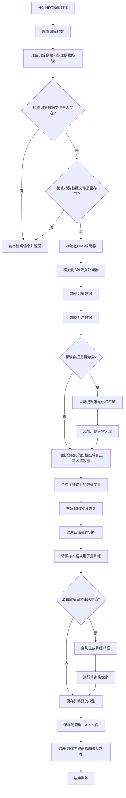
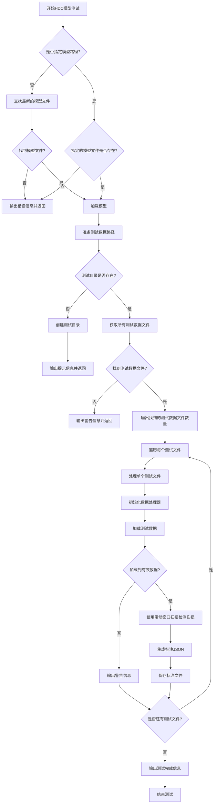
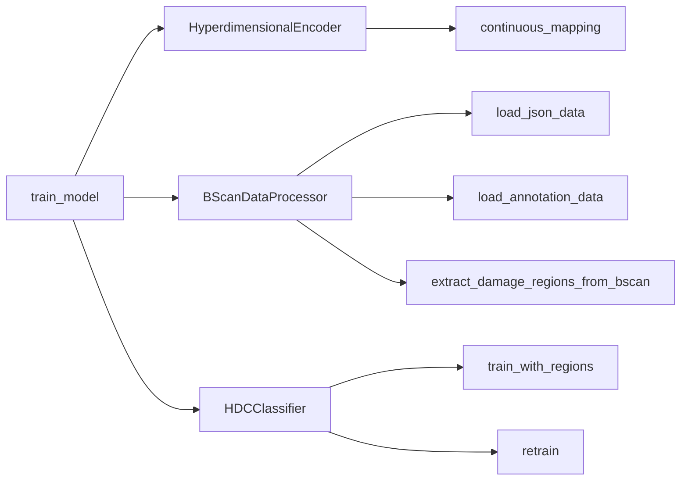
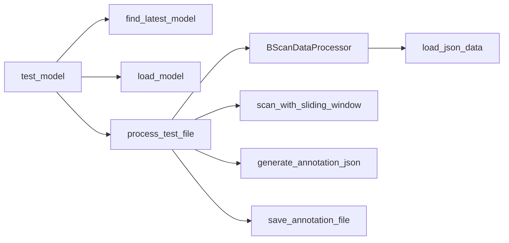
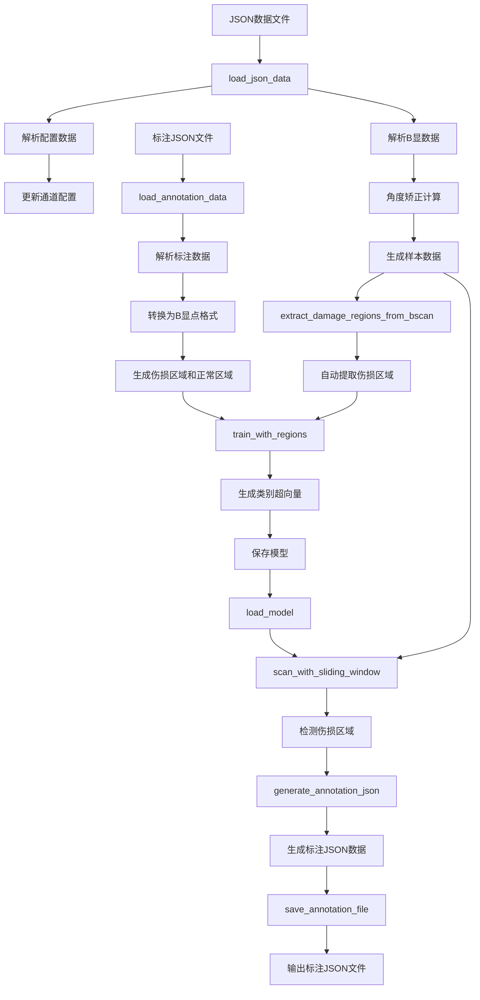
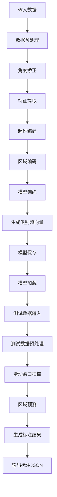

# HDC算法训练与测试流程图

## 1. 训练脚本 (hdc_train.py) 流程图

```mermaid
graph TD
    A[开始HDC模型训练] --> B[配置训练参数]
    B --> C[准备训练数据和标注数据路径]
    C --> D{检查训练数据文件是否存在?}
    D -->|否| E[输出错误信息并返回]
    D -->|是| F{检查标注数据文件是否存在?}
    F -->|否| E
    F -->|是| G[初始化HDC编码器]
    G --> H[初始化B显数据处理器]
    H --> I[加载训练数据]
    I --> J[加载标注数据]
    J --> K{标注数据是否为空?}
    K -->|是| L[自动提取潜在伤损区域]
    L --> M[添加示例正常区域]
    K -->|否| N[输出提取到的伤损区域和正常区域数量]
    M --> N
    N --> O[生成连续映射的数值向量]
    O --> P[初始化HDC分类器]
    P --> Q[使用区域进行训练]
    Q --> R[转换样本格式用于重训练]
    R --> S{是否需要自动生成标签?}
    S -->|是| T[自动生成训练标签]
    T --> U[进行重训练优化]
    S -->|否| V[保存训练好的模型]
    U --> V
    V --> W[保存配置到JSON文件]
    W --> X[输出训练完成信息和模型路径]
    X --> Y[结束训练]
```

## 2. 测试脚本 (hdc_test.py) 流程图

```mermaid
graph TD
    A[开始HDC模型测试] --> B{是否指定模型路径?}
    B -->|否| C[查找最新的模型文件]
    C --> D{找到模型文件?}
    D -->|否| E[输出错误信息并返回]
    D -->|是| F[加载模型]
    B -->|是| G{指定的模型文件是否存在?}
    G -->|否| E
    G -->|是| F
    F --> H[准备测试数据路径]
    H --> I{测试目录是否存在?}
    I -->|否| J[创建测试目录]
    J --> K[输出提示信息并返回]
    I -->|是| L[获取所有测试数据文件]
    L --> M{找到测试数据文件?}
    M -->|否| N[输出警告信息并返回]
    M -->|是| O[输出找到的测试数据文件数量]
    O --> P[遍历每个测试文件]
    P --> Q[处理单个测试文件]
    Q --> R[初始化数据处理器]
    R --> S[加载测试数据]
    S --> T{加载到有效数据?}
    T -->|否| U[输出警告信息]
    T -->|是| V[使用滑动窗口扫描检测伤损]
    V --> W[生成标注JSON]
    W --> X[保存标注文件]
    U --> Y{是否还有测试文件?}
    X --> Y
    Y -->|是| P
    Y -->|否| Z[输出测试完成信息]
    Z --> AA[结束测试]
```

## 3. 核心函数调用关系

### 3.1 训练脚本核心函数

```mermaid
graph LR
    train_model --> HyperdimensionalEncoder
    train_model --> BScanDataProcessor
    train_model --> HDCClassifier
    BScanDataProcessor --> load_json_data
    BScanDataProcessor --> load_annotation_data
    BScanDataProcessor --> extract_damage_regions_from_bscan
    HyperdimensionalEncoder --> continuous_mapping
    HDCClassifier --> train_with_regions
    HDCClassifier --> retrain
```

### 3.2 测试脚本核心函数

```mermaid
graph LR
    test_model --> find_latest_model
    test_model --> load_model
    test_model --> process_test_file
    process_test_file --> BScanDataProcessor
    BScanDataProcessor --> load_json_data
    process_test_file --> scan_with_sliding_window
    process_test_file --> generate_annotation_json
    process_test_file --> save_annotation_file
```

## 4. 数据处理流程

```mermaid
graph TD
    A[JSON数据文件] --> B[load_json_data]
    B --> C[解析配置数据]
    B --> D[解析B显数据]
    C --> E[更新通道配置]
    D --> F[角度矫正计算]
    F --> G[生成样本数据]
    H[标注JSON文件] --> I[load_annotation_data]
    I --> J[解析标注数据]
    J --> K[转换为B显点格式]
    K --> L[生成伤损区域和正常区域]
    G --> M[extract_damage_regions_from_bscan]
    M --> N[自动提取伤损区域]
    L --> O[train_with_regions]
    N --> O
    O --> P[生成类别超向量]
    P --> Q[保存模型]
    Q --> R[load_model]
    R --> S[scan_with_sliding_window]
    G --> S
    S --> T[检测伤损区域]
    T --> U[generate_annotation_json]
    U --> V[生成标注JSON数据]
    V --> W[save_annotation_file]
    W --> X[输出标注JSON文件]
```

## 5. 算法核心流程

```mermaid
graph TD
    A[输入数据] --> B[数据预处理]
    B --> C[角度矫正]
    C --> D[特征提取]
    D --> E[超维编码]
    E --> F[区域编码]
    F --> G[模型训练]
    G --> H[生成类别超向量]
    H --> I[模型保存]
    I --> J[模型加载]
    J --> K[测试数据输入]
    K --> L[测试数据预处理]
    L --> M[滑动窗口扫描]
    M --> N[区域预测]
    N --> O[生成标注结果]
    O --> P[输出标注JSON]
```